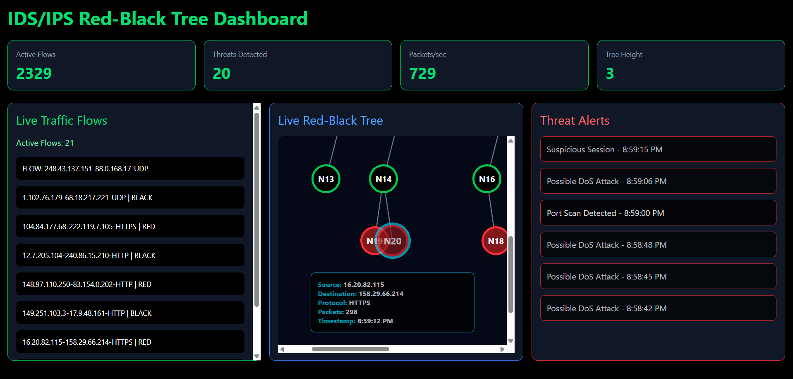
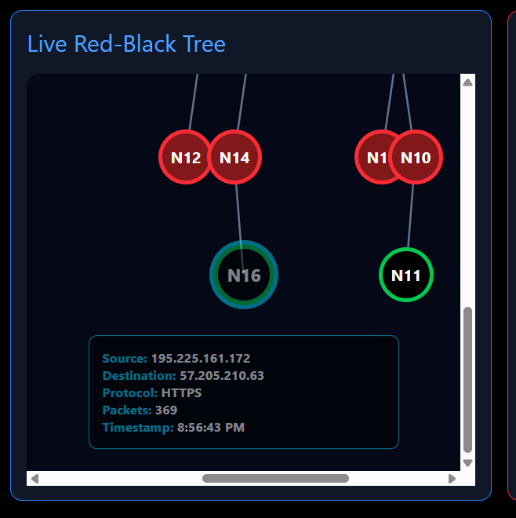
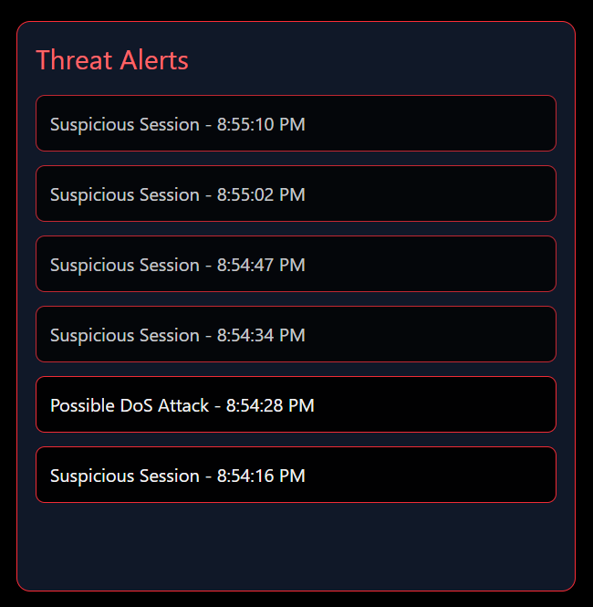
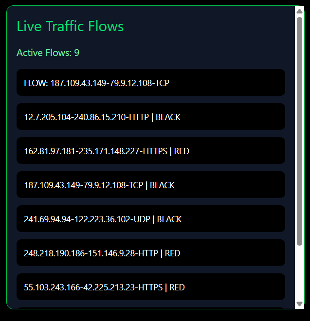

# 🛡️ Red-Black Tree Based Dynamic Flow Management in IDS/IPS Systems

> **Data Structures and Algorithms — Module Coursework**
> National Institute of Business Management | HND in Network Engineering (HNDNE25.2)

---

## 👥 Group Members

| Student ID | Name |
|---|---|
| COHNDNE252F-004 | K.A Baylon |
| COHNDNE252F-005 | S.M.J Nawarathna |
| COHNDNE252F-007 | J A K C Jayasinghe |

---

## 📌 Overview

This project is a simulation-based **Intrusion Detection and Prevention System (IDS/IPS)** built around a **Red-Black Tree (RBT)** data structure.

It demonstrates how a self-balancing binary search tree can be applied in a cybersecurity context to efficiently manage, organise, and monitor active network traffic sessions — with guaranteed **O(log n)** performance for search, insertion, and deletion operations.

The simulation provides:

- Real-time traffic generation and session management
- Dynamic Red-Black Tree visualisation
- Threat detection simulation (DoS, port scanning, SYN floods)
- Interactive dashboard analytics
- Educational algorithm visualisation

---

## 🖥️ Dashboard Preview

### Main Dashboard


### Tree Visualisation


### Threat Detection Panel


### Live Traffic Flow Panel


---

## 🚀 Getting Started

### Prerequisites

- [Node.js](https://nodejs.org/) v18 or higher
- npm (bundled with Node.js)

### Installation

```bash
# 1. Clone the repository
git clone https://github.com/Kendra-Bay/DSA-coursework.git
cd DSA-coursework

# 2. Install dependencies
npm install

# 3. Start the development server
npm run dev
```

Then open your browser at the local address shown in the terminal (usually `http://localhost:5173`).

---

## 📁 Project Structure

```
DSA-coursework/
│
├── conceptual-pseudocode/       # Pseudocode and algorithm planning documents
│
├── public/                      # Static assets served by Vite
│
├── screenshots/                 # Dashboard screenshots for README
├── src/
│   ├── algorithms/
│   │   └── RedBlackTree.js      # Core RBT implementation (insert, search, delete, rebalance)
│   ├── assets/
│   │   ├── hero.png
│   │   ├── react.svg
│   │   └── vite.svg
│   ├── components/
│   │   ├── MetricsCards.jsx     # Live session statistics cards
│   │   ├── ThreatPanel.jsx      # Simulated threat alert feed
│   │   ├── TrafficPanel.jsx     # Live traffic flow panel
│   │   └── TreeVisualizer.jsx   # Interactive RBT visualiser
│   ├── data/
│   │   └── packetGenerator.js   # Randomised network packet generator
│   ├── store/
│   │   └── treeStore.js         # Global state management for the RBT
│   ├── App.css
│   ├── App.jsx                  # Root application component
│   ├── index.css
│   └── main.jsx                 # Vite entry point
│
├── .gitignore
├── DSA presentation final.pptx  # Slide deck
├── README.md
├── eslint.config.js
├── index.html
├── package-lock.json
├── package.json
├── project_report.pdf           # Full written report
└── vite.config.js
```

---

## 🧩 Dashboard Components

### Traffic Flow Panel — `TrafficPanel.jsx`
- Displays live incoming network sessions
- Shows packet metadata: source IP, destination IP, ports, protocol
- Updates in real time as the packet generator runs

### Red-Black Tree Visualiser — `TreeVisualizer.jsx`
- Renders the RBT as a hierarchical, root-centred diagram
- Animates node insertions and rebalancing (rotations and recolouring)
- Hover over any node to inspect its session data

### Threat Alert Panel — `ThreatPanel.jsx`
- Displays simulated intrusion alerts with timestamps
- Classifies threats by type: DoS, port scan, suspicious activity, flooding

### Metrics Cards — `MetricsCards.jsx`
- Summarises live statistics: total sessions, active flows, threats detected

---

## 🌳 Red-Black Tree — Core Properties

Implemented in `src/algorithms/RedBlackTree.js`. The tree enforces:

- Every node is either **red** or **black**
- The **root** is always black
- **Leaf (NIL) nodes** are always black
- **No two adjacent red nodes** — a red node cannot have a red parent or child
- Every path from root to a leaf has the **same number of black nodes**
- Tree height is bounded by: `h ≤ 2 · log₂(n + 1)`

This guarantees **O(log n)** for all critical IDS operations:

| Operation | Complexity | IDS Use Case |
|---|---|---|
| Search | O(log n) | Match incoming packet to existing flow |
| Insertion | O(log n) | Register a new network session |
| Deletion | O(log n) | Expire idle or blocked sessions |

---

## 🛡️ Threat Detection Logic

Sessions are analysed after each insertion. Detection thresholds:

| Detection Type | Trigger Condition |
|---|---|
| DoS Attack | Extremely high packet count in a short window |
| Port Scanning | Rapid new session generation from a single source IP |
| Suspicious Activity | Abnormal traffic patterns or session duration |
| Flooding | Excessive packet insertion rate |

When a threat is detected, an alert is pushed to the Threat Alert Panel and the session is flagged for removal from the tree.

---

## 📊 Why Red-Black Tree?

| Data Structure | Search | Insert | Delete | Worst-Case Guarantee |
|---|---|---|---|---|
| **Red-Black Tree** | O(log n) | O(log n) | O(log n) | ✅ Yes |
| Hash Table | O(1) avg | O(1) avg | O(1) avg | ❌ No (collision attacks) |
| AVL Tree | O(log n) | O(log n) | O(log n) | ✅ Yes (more rotations) |
| Linked List | O(n) | O(1) | O(n) | ❌ No |

The RBT is selected over hash tables because it is **resistant to collision-based evasion attacks**, and over AVL trees because it requires **fewer rotations** under frequent insert/delete operations — a critical advantage in high-throughput IDS environments.

---

## ⚙️ Technologies Used

| Technology | Purpose |
|---|---|
| React.js | Frontend framework |
| Vite | Development build tool |
| Tailwind CSS | Dashboard styling |
| JavaScript (ES6+) | RBT algorithm and simulation logic |
| Node.js | Runtime environment |
| GitHub | Version control |
| Vercel | Deployment platform |

---

## 🌐 Deployment

This project is deployable on **Vercel** (recommended), Netlify, or GitHub Pages.

```
Live Demo: https://your-project-link.vercel.app
```

> Update this link after deploying.

---

## ⚠️ Current Limitations

This is an **educational simulation** and does not perform real intrusion detection.

- No real packet capture or live network monitoring
- Detection logic is heuristic and simulated
- No persistent database or authentication
- RBT balancing is simplified for visualisation clarity

---

## 🔮 Future Improvements

- Real packet capture via Wireshark integration
- Machine learning based anomaly detection
- Animated step-by-step tree balancing
- Attack heatmaps and historical logs
- Session timeout and expiry handling

---

## 📄 Academic Documents

| Document | Description |
|---|---|
| [`project_report.pdf`](./project_report.pdf) | Full written report |
| [`DSA presentation final.pptx`](./DSA%20presentation%20final.pptx) | Presentation slide deck |

---

## 📜 License

Educational use only. Developed as coursework for NIBM HNDNE25.2.
